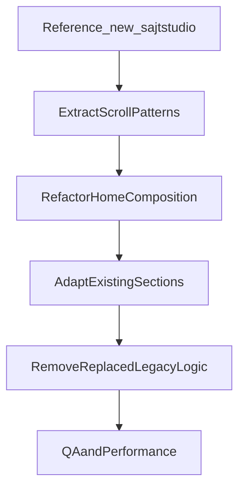

# Plan för nytt scrollflöde på nuvarande sajt

## Mål och avgränsning

- Vi arbetar endast i befintliga projektet: [src/app/page.tsx](src/app/page.tsx) m.fl.
- Vi skapar och använder branch: `feature/det-nya-sajtprojektet`.
- Projektet [C:/Users/jakem/dev/projects/new_sajtstudio](C:/Users/jakem/dev/projects/new_sajtstudio) används endast som referens (read-only), inga ändringar där.
- Scope för första implementation: **endast startsidan**.
- Vi behåller befintliga bilder, textinnehåll, CMS-kopplingar (T/B/V-nycklar), färgtema och affärslogik (API/admin/DB).

## Omfattningsbedömning

- **MVP (rekommenderad): 3-5 arbetsdagar**
  - Ny scroll-koreografi på startsidan + reducering av konflikterande gamla animationer.
- **Finputsning: +1-2 arbetsdagar**
  - Perf-tuning, mobila edge cases, mikrointeraktioner, ytterligare cleanup.

## Teknisk strategi (rekommenderad)

### Fas 1 - Fundament och säker avgränsning

- Skapa branch `feature/det-nya-sajtprojektet`.
- Etablera en tydlig "scroll choreography"-grund för startsidan i [src/app/page.tsx](src/app/page.tsx): sticky-block, längre scroll-zoner och sekventiella övergångar.
- Lägga till/utöka gemensamma scroll- och animationsutilities i [src/app/globals.css](src/app/globals.css) så flera sektioner kan återanvända samma mönster.

### Fas 2 - Mappa template-flöde till befintliga sektioner

- Behåll befintliga sektioner men ge dem nytt beteende via wrappers i [src/app/page.tsx](src/app/page.tsx):
  - Hero-sekvens: [src/components/sections/HeroSection.tsx](src/components/sections/HeroSection.tsx)
  - Mellansekvens: [src/components/sections/AboutSection.tsx](src/components/sections/AboutSection.tsx), [src/components/sections/USPSection.tsx](src/components/sections/USPSection.tsx), [src/components/sections/ServicesSection.tsx](src/components/sections/ServicesSection.tsx)
  - Showcase-sekvens: [src/components/sections/HeroAnimation.tsx](src/components/sections/HeroAnimation.tsx), [src/components/sections/TechShowcaseSection.tsx](src/components/sections/TechShowcaseSection.tsx), [src/components/sections/OpticScrollShowcase.tsx](src/components/sections/OpticScrollShowcase.tsx)
  - Avslutande sekvens: [src/components/sections/ProcessSection.tsx](src/components/sections/ProcessSection.tsx), [src/components/sections/TestimonialsSection.tsx](src/components/sections/TestimonialsSection.tsx), [src/components/sections/BigCTA.tsx](src/components/sections/BigCTA.tsx)
- Scrollflödet hämtar inspiration från template-komponenterna (sticky + progressdriven transform) men med nuvarande visuella identitet, innehåll och assets.

### Fas 3 - Ersätt gammal logik och städa bort döda trådar

- Identifiera animationer/effekter som blir överflödiga efter ny scroll-koreografi och ta bort dem i samma PR.
- Kandidater för reducering eller borttagning (endast om ersatta):
  - [src/components/animations/ScrollIndicator.tsx](src/components/animations/ScrollIndicator.tsx)
  - Tunga/överlappande delar i [src/components/sections/HeroSection.tsx](src/components/sections/HeroSection.tsx)
  - Eventuella oanvända imports/hjälpfunktioner i berörda sektioner.
- Säkerställ att vi inte lämnar "spöktrådar" (oanvänd kod som pekar mot tidigare beteende).

### Fas 4 - Navigering, UX och kvalitetssäkring

- Säkra att hashnavigation + header-offset fungerar med nya sticky-zoner i [src/components/layout/HeaderNav.tsx](src/components/layout/HeaderNav.tsx).
- Verifiera mobil/prestanda/reduced-motion i berörda sektioner.
- Kontrollera att footer- och sidslut känns konsekvent med det nya scrollflödet i [src/components/layout/Footer.tsx](src/components/layout/Footer.tsx).
- Köra lint/build och fixa regressions i ändrade filer.

## Leveransordning

1. Branch + grundlayout för nytt scrollflöde på startsidan.
2. Hero + mellansektioner.
3. Showcase + avslutande sektioner.
4. Cleanup av ersatt logik.
5. QA/perf-pass och justeringar.

## Rekommendation för hur vi går vidare

- Starta med **MVP på startsidan** (ingen ändring av API/admin/DB/routing).
- Jobba iterativt sektion-för-sektion så du snabbt kan godkänna visuellt uttryck.
- Efter MVP: besluta om vi skalar samma scrollspråk till t.ex. [src/app/portfolio/page.tsx](src/app/portfolio/page.tsx) i nästa branch/iteration.

